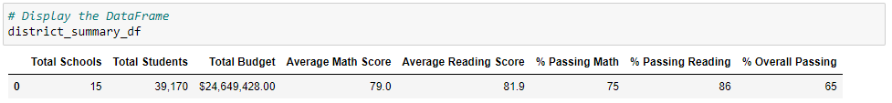
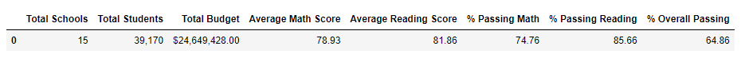
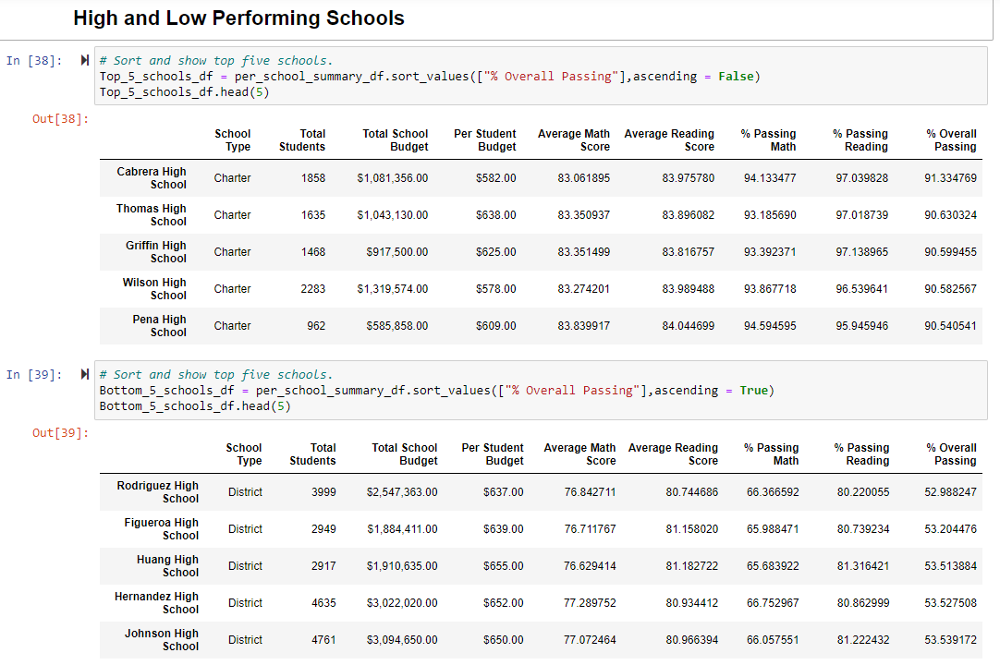
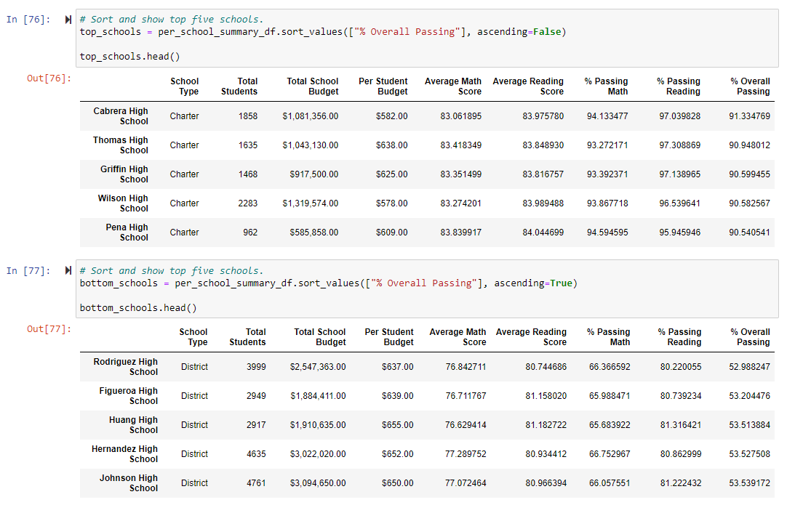

# **School District Analysis Challenge**

*PyCitySchools*

## Data Environment

* Anaconda / GitBash / Jupyter Notebook / Numpy / Pandas / Python

## Goal for code

Help a school district dive into key metrics such as per student cost/investment and grades.  The data needed to be broken out by school and school type along with a breakout of individual grades.  This code was written to meet those objectives but after further review, the data from Thomas High School's 9th grade class was suspected of foul play.  For this reason the new task for the code was to remove the suspect THS data and for this schools individual data to be analyzed again for comparison.

## Implementation of tools:

Use Jupyter Notebook files and connect to resource CSV files containing school data.  The data was then scrubbed, organized, and formatted for a variety of DataFrames. Key steps taken required use of merge, filter, slice, and sort functions.  The groupby function was helpful as well to organize the DataFrames.

## Updated Analysis

The original analysis including the suspect THS data showed the following:

After nullifying the suspect THS testing data, the recalculated scores didn’t move significantly.  The new aggregate data was still with a single percentage of the original data:

Further analysis after the removal of the suspect 9th grade THS data showed that the school dropped from the top five ranking down to the middle of the pack.

The orignal analysis is shown below, THS holds the number 2 spot:

THS without the 9th grade data places the school near the middle of the pack.

The suspected inflated 9th grade data significantly pumped up THS's performance in the district.

## Conclusion
Key Findings After New Data Analysis:
- The overall passing percentage for THS significantly was impacted changing from 91% down to 65%.
- The overall ranking for THS is now average vs the original findings placing it in the top 5 from the district.
- All percentages from THS are now shifted lower removing the suspect 9th grade data.
- On a large scale the small numbers from THS don't affect the school district but on a individual level the adjustments are large.
